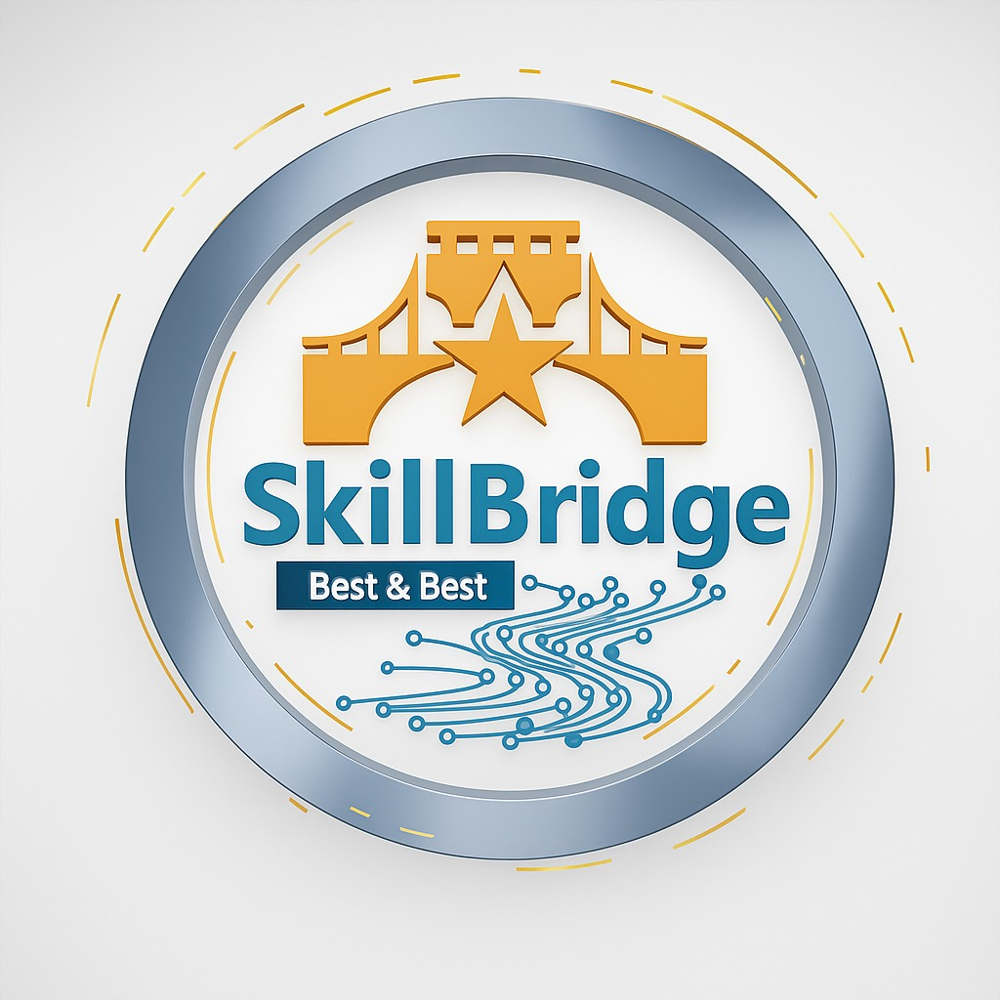

  

<h1 align="center">🚀 SkillBridge — From Learning to Employability</h1>
<h3 align="center">Best & Best</h3>

---

## 🧩 Overview

**SkillBridge** is an AI-driven learning ecosystem that bridges the gap between **education and employability**.  
It transforms how students **learn, apply, and prove** their skills through **AI project evaluation**, **real-world applications**, and **verified digital portfolios**.

> “We don’t just give certificates — we give proof of skill.”

---

## 🎯 Mission

To **bridge the gap between learning and employability** by enabling students to build real-world projects, get AI-based evaluations, and create verified portfolios showcasing their growth and technical competence.

---

## 💡 The Problem

Most edtech platforms stop at:
- Providing online courses  
- Issuing certificates after quizzes or assignments  

They fail to assess:
- Whether students can apply their skills to **real-world problems**  
- How **efficient** or **innovative** their solutions are  
- How much **growth** a student shows over time  

As a result:
🎓 Students have certificates but no **proof of practical ability**, and  
🏢 Employers struggle to verify **job readiness**.

---

## 🧠 The SkillBridge Solution

SkillBridge turns every student’s learning journey into a **verifiable, employability-ready portfolio** using AI analytics and project-based evaluations.  
It’s not just another course platform — it’s a **Skill-to-Employability Pipeline**.

---

## ⚙️ How It Works

### 🧭 Personalized Learning Tracks
- Beginner to advanced learning paths in **AI, Web Development, Data Science**, etc.  
- Each path focuses on **application-first learning**.

### 🧩 Hands-On Projects
- Every module includes **industry-aligned real-world projects**.

### 🤖 AI-Based Project Analyzer (Core Innovation)
- Evaluates **code quality**, **logic efficiency**, **scalability**, and **innovation**.  
- Detects use of **best practices** and **optimization patterns**.  
- Generates a **Skill Performance Score (SPS)** with improvement feedback.

### 🧠 Skill Progress Graph
- Tracks continuous improvement across:
  - Problem-solving  
  - Creativity  
  - Technical accuracy  
  - Collaboration

### 📜 Performance-Based Certification
- Certificates backed by **real project analytics** and **SPS scores** — proof of ability, not just attendance.

### 💼 Dynamic Portfolio (SkillGraph)
- AI auto-generates a **living portfolio** with all verified projects and metrics, shareable with recruiters.

---

## 🔍 Unique Features

| Feature | Description |
|----------|-------------|
| 🤖 **AI Project Analyzer** | Evaluates and grades projects using ML/NLP-based code analysis. |
| 📈 **Skill Performance Score (SPS)** | Smart metric combining accuracy, creativity, and efficiency. |
| 🧠 **Personalized Learning Path** | Adapts course flow based on AI-detected weak areas. |
| 💼 **Dynamic Skill Portfolio** | Shows verified, real-world skills with growth analytics. |
| 🎓 **Performance-Based Certificates** | Backed by project performance, not just participation. |
| 🤝 **Mentorship & Peer Review** | Combines AI feedback with human mentorship for better outcomes. |

---

## 💼 Business & Growth Model

- **Freemium Access:** Free basic learning + paid AI evaluation & certification.  
- **B2B Integration:** Partnerships with colleges and institutions for student assessment.  
- **TalentBridge Network:** Enables recruiters to find pre-verified talent.  
- **Analytics Dashboard:** Provides institutions with real-time skill insights.

---

## 🌍 Vision

> “To turn every learner’s effort into measurable employability.”

SkillBridge aims to redefine the future of education:
- Every student leaves with **proof of skill**, not just a certificate.  
- Every employer hires based on **verified data-driven portfolios**.

---

## 🏁 Impact

Creating a generation of **Job-Ready Graduates** —  
where every learning milestone is **recorded**, **measurable**, and **meaningful**.

Our ultimate vision:  
> “Turn learning into employability, and education into experience.”

---

## 🧑‍💻 Founder

**P.Sainath** — Founder of **SkillBridge**

📧 sainathpendalwar43@gmail.com  
🌐 [LinkedIn](www.linkedin.com/in/pendalwar-sainath-598169349) | 
🌐 [Portfolio](https://sainath9391.github.io/SmartPortfolio_Sainath/)

---

## 🏗️ Repository Structure (Upload soon...)

## 🪄 Tech Stack (Recommended)
- **Frontend:** React.js / HTML / CSS / JavaScript  
- **Backend:** Node.js / Express.js  
- **Database:** MongoDB  
- **AI/ML Layer:** Python (NLP, ML model for code evaluation)  

---

## ⭐ Contribution

We welcome contributions from students, developers, and educators!  
Fork this repository, make improvements, and open a **pull request**.

---

## 📜 License

This project is licensed under the **MIT License** — feel free to use and modify.

---

## ❤️ Acknowledgments

Special thanks to the student community and mentors who inspire us to **build for employability, not just education.**

